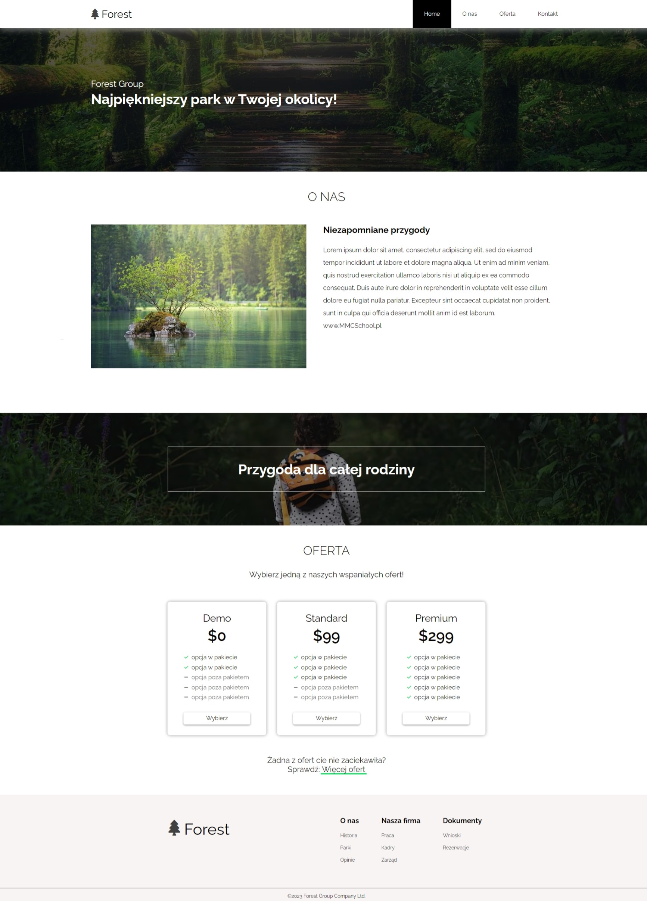

# Forest Website project

## Table of contents

- [Overview](#overview)
  - [Screenshot](#screenshot)
  - [Links](#links)
- [My process](#my-process)
  - [Built with](#built-with)
  - [What I learned](#what-i-learned)

## Overview

### Screenshot

### Links

- Live Site URL: [Live Site](https://adrianmaj.github.io/ForestWebsite/)

## My process

### Built with

- Semantic HTML5 markup
- CSS custom properties
- Flexbox
- CSS Grid
- Mobile-first workflow
- JavaScript

### What I learned

Thanks to this project, I learned how to create entire sites based on mockup, how to build a site that works and attracts users and is well positioned in browsers. I remembered a lot of things I learned before and consolidated my knowledge.
